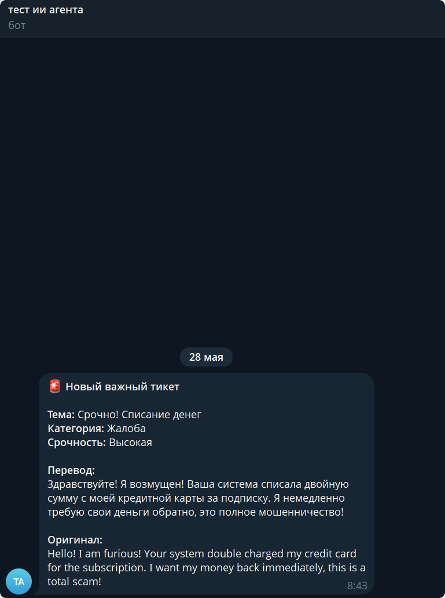

# AI Ticket Agent (FastAPI & Gemini)

Автоматизированный ИИ-агент для классификации и обработки входящих тикетов поддержки с интеграцией в Telegram.

🌐 **Живое демо проекта (API Docs):** [https://ai-ticket-agent-fastapi.onrender.com/docs](https://ai-ticket-agent-fastapi.onrender.com/docs)

Асинхронный ИИ-агент (микросервис) на базе **FastAPI**, разработанный для автоматизации обработки входящих обращений (тикетов) в службу поддержки. 

Система полностью переведена на архитектуру **Webhooks**, что позволяет обрабатывать входящие сообщения мгновенно (в real-time режиме) без холостых запросов к серверам.

## 🔥 Ключевые возможности
- **FastAPI Webhook Architecture:** Эндпоинт `/webhook/new-ticket` принимает JSON-данные от внешних CRM-систем (Zendesk, HubSpot, Shopify и др.).
- **Интеллектуальный анализ (Gemini API):** Робот автоматически переводит текст обращения на русский язык, определяет категорию (Жалоба, Вопрос по цене и т.д.) и выставляет уровень срочности.
- **Отказоустойчивость (Model Fallbacks):** Код автоматически запрашивает список доступных моделей у Google API и имеет систему резервных кандидатов (если одна модель перегружена, запрос подхватывает другая).
- **Защита от дубликатов:** Интегрированная БД SQLite проверяет `message_id` перед отправкой в ИИ, экономя деньги на API-запросах.
- **Real-time Telegram Алерты:** При обнаружении критических категорий ("Жалоба") или высокой срочности система мгновенно вызывает менеджера-человека через Telegram Bot API.

## 🛠️ Стек технологий
- Python 3.10+ (Asyncio)
- FastAPI / Uvicorn (REST API)
- Pydantic v2 (Валидация данных)
- SQLite3 (Реляционная база данных)
- Requests (Взаимодействие с Gemini & Telegram API)

## 📦 Как запустить проект локально

1. Клонируйте репозиторий с GitHub.
2. Установите необходимые зависимости:
```bash
pip install -r requirements.txt
```
3. Настройте переменные окружения (см. раздел ниже).
4. Запустите сервер FastAPI:
```bash
python app.py
```

## ⚙️ Настройка переменных окружения (API Ключи)

Для работы ИИ-агента и отправки уведомлений необходимо настроить три переменные окружения. Вы можете сделать это двумя способами:

### Способ 1: Напрямую в консоли PowerShell (Перед запуском)
Выполните в терминале следующие команды, подставив свои реальные данные:
```powershell
$env:GOOGLE_API_KEY="ваш_длинный_ключ_gemini_api"
$env:TELEGRAM_BOT_TOKEN="токен_вашего_бота_из_BotFather"
$env:TELEGRAM_CHAT_ID="id_вашего_телеграм_чата_или_канала"
```

### Способ 2: Через файл `.env` (Рекомендуемый для разработки)
1. Создайте в корневой папке проекта файл с именем `.env`
2. Добавьте в него следующие строки:
```env
GOOGLE_API_KEY=ваш_длинный_ключ_gemini_api
TELEGRAM_BOT_TOKEN=токен_вашего_бота_из_BotFather
TELEGRAM_CHAT_ID=id_вашего_телеграм_чата_или_канала
```
*⚠️ Внимание: Файл `.env` уже добавлен в `.gitignore` и никогда не попадет в открытый доступ на GitHub ради вашей безопасности.*

## 🎯 Как протестировать и использовать проект

После того как сервер успешно запустился и в консоли появилась строка `Application startup complete`, проект готов к работе. Вы можете проверить его следующими способами:

### 1. Интерактивная документация (Swagger UI)
FastAPI автоматически генерирует удобный веб-интерфейс для тестирования запросов:
- Откройте браузер и перейдите по адресу: [http://127.0.0.1:8000/docs](http://127.0.0.1:8000/docs) *(или укажите порт 8080, если вы изменили его в коде)*.
- Найдите эндпоинт `POST /webhook/new-ticket`, нажмите **"Try it out"**, вставьте тестовый JSON и нажмите **"Execute"**.

### 2. Симуляция входящего вебхука через PowerShell
Чтобы сымитировать отправку обращения из внешней CRM-системы (например, Zendesk), откройте **новое (параллельное)** окно PowerShell и выполните следующую команду:

```powershell
Invoke-RestMethod -Uri "[http://127.0.0.1:8000/webhook/new-ticket](http://127.0.0.1:8000/webhook/new-ticket)" -Method Post -ContentType "application/json" -Body '{"message_id": "ticket_free_001", "text": "Здравствуйте! Вчера оплатил подписку, но личный кабинет до сих пор заблокирован. Верните деньги или почините!"}'
```

**Что произойдет после отправки:**
1. В консоли работающего сервера отобразится лог обработки запроса.
2. Нейросеть Gemini автоматически переведет текст, определит категорию как *"Жалоба / Проблема с оплатой"* и выставит статус *"Высокая срочность"*.
3. Данные сохранятся в локальную базу данных SQLite (с защитой от дубликатов по `message_id`).
4. В ваш Telegram-чат мгновенно прилетит экстренное уведомление с деталями тикета для менеджера.
```

## 📸 Пример работы системы

Когда в систему поступает критический тикет или жалоба, ИИ автоматически распознает приоритет, а бот мгновенно отправляет структурированное уведомление в Telegram:

